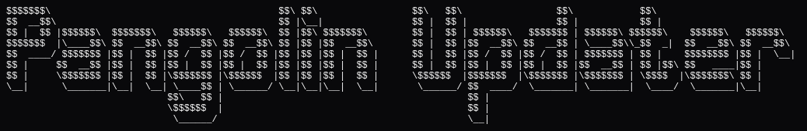

# Pangolin Updater (CLI)

<p align="center">
  
</p>

A CLI utility to manage a root-run Pangolin Docker Compose stack in `/root`.

It is designed for environments where:
- `/root/docker-compose.yml` defines `pangolin`, `gerbil`, and `traefik`
- `/root/config/` contains Pangolin and related runtime data
- Services are managed with `docker compose`

---

## What it does

### 1) Backup
- Creates `/root/backup/` if needed
- Creates timestamped archives: `pangolin-backup-YYYY-MM-DD_HH-MM-SS.tar.gz`
- Archives:
  - `/root/docker-compose.yml` as `docker-compose.yml`
  - `/root/config/` as `config/`
- Applies backup retention policy automatically
- Optionally cleans up `/root/docker-compose.yml.bak.*` safety files

### 2) Update
1. Optionally creates a backup first (recommended)
2. Reads current pinned tags from `/root/docker-compose.yml`
3. Fetches stable GitHub release tags for Pangolin, Gerbil, and Traefik (excluding prerelease/draft, `-rc`, and `-ea`)
4. Shows a numbered selector per service:
  - Upgrades listed first
  - Current version near the bottom, labeled `(Current)`, and selected by default on Enter
  - One downgrade option
  - Release page links shown inline
  - Pangolin includes a callout recommending upgrade-by-upgrade rollout with backup/testing at each step
5. Shows planned changes and exits early if everything is unchanged
6. On confirmation, writes compose update (with a timestamped `.bak` safety copy), then runs:
  - `docker compose down`
  - `docker compose up -d`
7. Optionally prunes unused Docker images

### 3) Restore
1. Lists available backups from `/root/backup/`
2. Lets you choose one and requires explicit `YES` confirmation
3. Pre-validates/extracts archive contents to a temp directory safely
4. Stops stack with `docker compose down`
5. Restores:
  - `/root/docker-compose.yml`
  - `/root/config/` (replaced using staged rollback protection)
6. Starts stack again with `docker compose up -d`
7. Cleans temp extraction files
8. If restore fails after stopping containers, it attempts to bring the stack back up automatically

### 4) Close
Exits the tool.

---

## Requirements
- Linux host
- Docker installed and running
- Docker Compose v2 (`docker compose ...`)
- Run as root (uses `/root` paths and manages Docker)

---

## Paths used

Expected:
- `/root/docker-compose.yml`
- `/root/config/`

Created/used:
- `/root/backup/`

---

## Usage
```bash
updater
```

Menu:
- `[1] Backup`
- `[2] Update`
- `[3] Restore`
- `[4] Close`

---

## Installation

### Install script (recommended)
```bash
chmod +x install.sh
sudo ./install.sh
```

Force reinstall even when installed version is equal/newer:
```bash
sudo ./install.sh --force
```

Verify:
```bash
which updater
updater --version
```

### Manual install
```bash
sudo install -m 0755 ./pangolin_updater.py /usr/local/bin/updater
```

### Uninstall
```bash
chmod +x uninstall.sh
sudo ./uninstall.sh
```

---

## Troubleshooting

### "This tool must be run as root"
```bash
sudo updater
```

### "Missing /root/docker-compose.yml" or "Missing /root/config directory"
Ensure both paths exist.

### Docker command failures
Try the command manually:
```bash
cd /root
docker compose up -d
```
